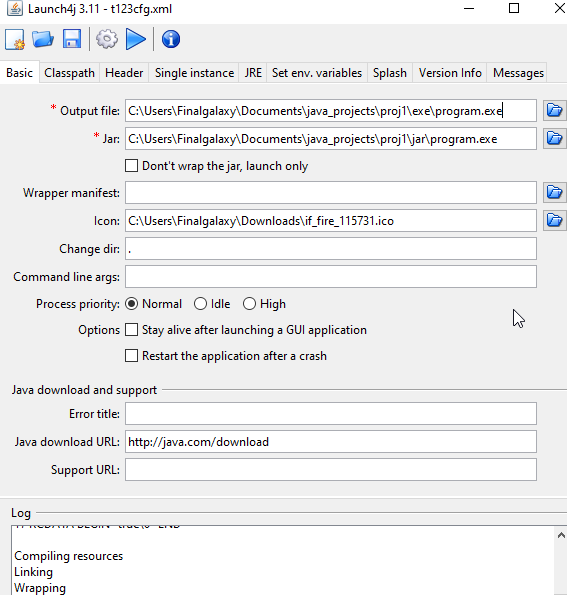

# Make your JAR a standalone executable

Hello! I was doing some researches about how can I convert my complex JAR program (12 MB) in a standalone executable that can be runned without JRE installed.
I am using Launch4J; in this repository I'll show you how to use it.

## What do I need?
- Java installed (For developer machine);

- Launch4J: https://sourceforge.net/projects/launch4j/

- Your JAR (Make sure it runs correctly in a machine with Java installed);

- A .ico file as icon for your exe built file (You can download them for example for free from https://www.iconfinder.com or make/buy custom icons, or google .ico);

- A JRE to bundle to your exe built file (Read below).

## Why do I need a JRE bundled?
Java applications, as you know, can be executed thanks to a Java Virtual Machine (JVM), that can be a JRE (Java Runtime Environment) or a JDK (Java Development Kit).

Without a JVM, Java applications just cannot be executed and they look as raw archives to a normal user. In Windows systems for customers, Java is normally NOT installed, so customers would be very confused and annoyed to go to Java website and download JVM to run their jar file. This could cause potential loss of customers and downvote your product.

Launch4J allows you to bundle a JVM inside exe file, so:
- You can ensure to run your application with a minimum JVM version;
- Customers don't have to worry about downloading Java on their machines;
- So basically your application becomes portable. :P

## What JRE do I need?
Try to pick the lowest JRE possible that can run your project. Make a compromise between compatibility and security. Oracle fixes Java vulnerabilities by updating their JVMs, so it is always recommended to choose a good updated JRE.

You can download the latest JRE if you need best security possible and don't need compatibility with older machines.
You can download older JRE if compatibility is a concern from you enough to withdraw security.

- Latest JRE: http://www.oracle.com/technetwork/java/javase/downloads/jre8-downloads-2133155.html (Or google "JRE download")
- Older JREs: http://www.oracle.com/technetwork/java/javase/downloads/java-archive-javase8-2177648.html (Pick a 32 bit version)

Choose .tar.gz archive for download.

# How to do it:
In this project I'll assume your Java project dir has this path for ease of understanding: C:\Users\Finalgalaxy\Documents\java_projects\proj1\

- Download everything necessary;
- Unzip JRE downloaded inside proj1 folder, so that you have JRE unpacked in C:\Users\Finalgalaxy\Documents\java_projects\proj1\jre1.8.0_151\ (Using jre1.8.0_151 as example);
- Follow the images.

### Basic

# Info and tips
- Output file: the location where your exe file is built in;
- Jar: the jar that needs to be packaged into a built exe file;
- Icon: your .ico file;
- Header type: how your java program looks like (Does it have a GUI?)
- Single instance: check "Allow only a single instance of the application" and place as mutex your app name (or a substring) to ensure processes containing that mutex won't run at same time;
- Bundled JRE path: this is the folder of your JRE, type in jre1.8.0_151. Type bin\jre1.8.0_151 if you placed JRE in a subfolder called bin;
- Min JRE version: this ensures that your applications runs at least on the minimum JRE version that is set (For example 1.8.0).

There are many other options to check them out.
